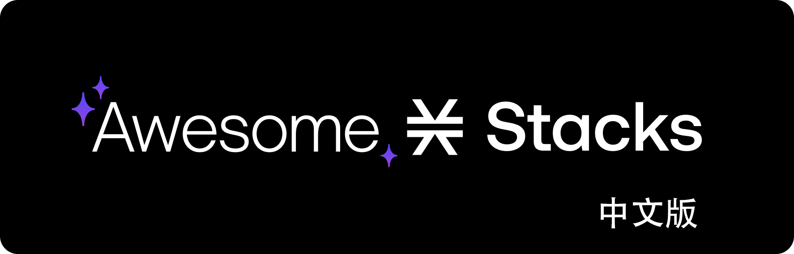

# Awesome Stacks

* 本文翻译自https://github.com/friedger/awesome-stacks-chain

[Stacks](https://www.stacks.co/what-is-stacks) 是一个由比特币锚定的区块链，支持应用程序、智能合约和数字资产。Stacks 是一个连接到比特币的Layer-1区块链，并通过[Clarity语言](https://clarity-lang.org/)实现智能合约和去中心化应用程序。通过[转移证明（PoX）共识机制](https://docs.stacks.co/stacks-101/proof-of-transfer)，将Stacks 区块链的状态锚定在比特币区块链上，从而为 Stacks 提供等同于比特币网络的安全性。Stacks 将其他区块链技术的可编程性带到比特币中的同时无需修改比特币自身的核心共识机制。

## 目录

<!-- START doctoc generated TOC please keep comment here to allow auto update -->
<!-- DON'T EDIT THIS SECTION, INSTEAD RE-RUN doctoc TO UPDATE -->
<!--lint ignore awesome-list-item-->

- [应用程序](#应用程序)
  
  - [钱包](#钱包)
  
  - [Stacks Web 应用](#Stacks Web 应用)
  
  - [BNS域名](#BNS域名)
  
  - [去中心化金融 (DeFi)](#去中心化金融 (DeFi))
  
  - [游戏](#游戏)
  
    
  
- [Clarity相关资源](#Clarity相关资源)
  
  - [开发者工具](#开发者工具)
  - [示例合约](#示例合约)
  - [库](#库)
  - [合约](#合约)
  - [非同质化代币 (NFT)](#非同质化代币 (NFT))
  - [同质化代币(FT)](#同质化代币)
  - [质押](#质押)
  
- [Dapp开发工具](#Dapp开发工具)
  
  - [SDK](#SDK)
  - [CLI](#cli)
  - [存储](#存储)
  - [API服务](#API服务)
  
- [学习资源](#学习资源)
  
  - [文档](#文档)
  - [视频](#视频)
  - [教程](#教程)
  - [图书](#图书)
  - [课程](#课程)
  
- [社区](#社区)

<!-- END doctoc generated TOC please keep comment here to allow auto update -->

## 应用程序

### 钱包

- [Asigna](https://asigna.io/) - 支持多签的钱包，适用于比特币、Ordinals、BRC20 和 Stacks。
- [Leather Wallet](https://leather.io/install-extension) - 开源钱包，仅支持比特币和 Stacks 生态。[桌面端版本](https://leather.io/install-desktop)。
- [Xverse Wallet](https://www.xverse.app/) - 移动钱包应用及浏览器插件，用于管理比特币、STX 和质押（部分开源）。

### Stacks Web 应用

- [Hiro Explorer](https://explorer.hiro.so/?chain=mainnet) - 区块链浏览器。
- [STX Scan](https://stxscan.co/) - 区块链浏览器。
- [Send Many](https://sendstx.com) - 一键向多个接收者发送 STX 和其他代币。
- [Sigle](https://www.sigle.io/) - 去中心化写作平台。
- [Console](https://www.console.xyz/) - 去中心化社交应用。
- [Blocksurvey](https://blocksurvey.io/) - 以数据所有权和隐私为重点的 AI 驱动的问卷调查平台。
- [MultiSafe](https://github.com/Trust-Machines/multisafe) - 金库，用于管理 Stacks (STX) 和比特币 (BTC)。

### BNS域名

- [BNSx](https://www.dots.so/) - 用一个账户管理多个 BNS 域名(1:n)。

- [btc.us](https://btc.us) - 用于注册 .btc 域名的应用程序。

- [BNS search](https://www.bnssearch.com/) - 用于搜索注册的 BNS 域名的应用程序。

- [BNS and Ordinals](https://www.bns.xyz/) - 将 BNS 域名通过 Ordinal 存储。

- [Owl.link](https://owl.link) - 用于为 BNS 名称创建链接页面的应用程序。

  

### 去中心化金融 (DeFi)

- [Alex Lab](https://app.alexlab.co) - 一个 DeFi 服务平台。
- [Arkadiko Protocol](https://github.com/arkadiko-dao/arkadiko) - 基于自我偿还贷款的稳定币 (USDA)。
- [Bitflow](https://www.bitflow.finance/) - 去中心化交易所。
- [Velar](https://www.velar.co/) - 在比特币 L2 上进行代币交换、交易和发起资产的平台。
- [Zest Protocol](https://www.zestprotocol.com/) - 在比特币和 Stacks 上的去中心化借贷协议。
- [STX20](https://github.com/fess-v/stx20-standard) - 用于在 Stacks 上创建和共享数字艺术品的协议。
- [STXTools](https://stxtools.io/) - 用于在 Stacks 上的 DeFi 图表、交易和价格警报工具。
- [Stacks Pulse](https://github.com/pradel/stackspulse) - 实时监控 Stacks 链上的 DeFi 状态。
- [Signal21](https://signal21.io/) - 比特币 L1、L2 和 Dapps 的链上分析工具。
- [Lydian](https://app.lydian.xyz) - 去中心化的财政管理协议（已停运）。
- [CityCoins](https://minecitycoins.com) - 城市代币（正在逐步关闭）。

### 游戏

- [Stacks Degens](https://stacksdegens.com) - 一个通过 NFT 实现的像素风赛车游戏。
- [Project Indigo](https://www.projectindigonft.com) - 一个交互式的RPG游戏。

## Clarity相关资源

### 开发者工具

- [Clarinet](https://github.com/hirosystems/clarinet) - Clarity 的命令行工具，用于开发和测试 Clarity 智能合约。
- [Clariform](https://github.com/njordhov/clariform) - Clarity 的代码格式化和语法检查工具。
- [Clarigen](https://github.com/obylabs/clarigen) - 用于编写与 Clarity 智能合约交互的 TypeScript 代码的工具。
- [clarity.tools](https://clarity.tools) - 运行在浏览器中的 Clarity 交互执行环境。
- [ClarityGPT Prompt](https://claritygpt.com/) - 使用GPT编写Clarity智能合约的Prompt。
- [Hiro Platform](https://platform.hiro.so/) - 浏览器中的集成开发环境 (IDE)。

### 示例合约

- [Source of Clarity](https://source-of-clarity.com) - 已部署到主网的一些 Clarity 合约列表，并附有一些注释。
- [示例合约](https://github.com/hirosystems/clarity-examples) - 一组示例智能合约，可以作为学习clarity合约的起点。
- [经过审计的示例智能合约](https://github.com/clarity-lang/book/tree/main/projects) - 已进行安全审计的示例智能合约，。

### 库

- [uint256](https://github.com/KStasi/clarity-uint256-lib) - 一个将值转换为 256 位的库。
- [clarity-bitcoin](https://github.com/friedger/clarity-bitcoin) - 验证比特币交易的库。

### 合约

- [CityCoin](https://github.com/citycoins/citycoin) - 使用 STX 转账按照比例概率铸造新币的 PoX Lite 实现。
- [SWAPR](https://github.com/psq/swapr) - 在 Stacks 2.0 和 Clarity 上实现的功能类似于 Uniswap 的合约。
- [FLEXR](https://github.com/psq/flexr) -  [Ampleforth](https://www.ampleforth.org/) 的 Clarity版本。
- [ClarityDAO](https://github.com/friedger/clarity-dao) - Moloch DAO 的 Clarity 版本。
- [NFT Marketplace](https://github.com/friedger/clarity-marketplace/blob/master/contracts/market.clar) - 用于交易资产的市场合约。
- [StackStarter](https://github.com/MarvinJanssen/stackstarter/blob/master/contracts/stackstarter.clar) - 用于众筹的 Clarity 智能合约。
- [Lightning Swaps](https://github.com/radicleart/clarity-rstack/blob/master/contracts/lightning-swaps-v1.clar) - 使用闪电网络实现防欺诈交换证明。
- [Election Voting](https://github.com/elbaruni/clarity-election/blob/master/contracts/election.clar) - 使用 Clarity 进行候选人投票的基本合约。
- [DualX](https://github.com/westridgeblockchain/dualX) - 一组实现去中心化交易生态系统的 Clarity 合约。
- [ExecutorDAO](https://github.com/MarvinJanssen/executor-dao) - 一个用于在智能合约中构建 DAO 功能的 Clarity 框架。
- [Digital Will](https://github.com/LoRdSoban/Cryptonomers) - 有条件的资金转移合约。

### 非同质化代币 (NFT)

- [This is #1](https://www.thisisnumberone.com) - 在比特币和 Stacks 区块链上构建的第一个专业 NFT ([合约](https://explorer.hiro.so/txid/SP3QSAJQ4EA8WXEDSRRKMZZ29NH91VZ6C5X88FGZQ.thisisnumberone-v2?chain=mainnet))。
- [Smart Contract GPT](https://github.com/Markeljan/smart-contract-gpt) - 一个用于创建 SIP-009 合约的聊天机器人。

### 同质化代币

- [Nothing](https://nothingtoken.xyz/) - 一个无实际作用的同质化代币 ([合约](https://explorer.hiro.so/txid/SP32AEEF6WW5Y0NMJ1S8SBSZDAY8R5J32NBZFPKKZ.nope?chain=mainnet))。

### 质押

- [Stacking Pools](https://github.com/friedger/clarity-stacking-pools) 
- [Stacks Pools](https://github.com/degen-lab/stacks-pools) 

## Dapp开发工具

### SDK

- [Stacks.js](https://github.com/hirosystems/stacks.js) - 用于与 Stacks 区块链交互的 JavaScript 库。
- [stacks.rs](https://github.com/52/stacks.rs) - 用于与 Stacks 区块链交互的 Rust 库。
- [stacks.py](https://github.com/rohitverma007/stackspy) - 用于与 Stacks 区块链交互的 Python 库。

### CLI 

- [@stacks/cli](https://github.com/hirosystems/stacks.js/tree/master/packages/cli) - 用于交互授权、存储和交易的命令行接口。

### 存储

- [CompassDB](https://github.com/eder-ai/compass-db) - 用于管理Gaia存储的库。
- [lens-file-source](https://gitlab.com/MyLens/lens-file-source) - 通过缓存、事务和JSON映射聚合等机制实现文件存储抽象的Gaia
- [GaiaDown](https://github.com/AcidLeroy/gaiadown-ts) - [LevelUp](https://github.com/Level/levelup) 的Gaia存储后端。

### API服务

- [Stacks API](https://www.hiro.so/stacks-api) - 托管 API，用于直接与区块链交互以查询信息、广播交易。
- [Quicknode](https://www.quicknode.com/chains/stx) - 托管节点，使用 Quicknode 快速轻松地连接到 Stacks。
- [Self-Hosted Render](https://github.com/stacksfoundation/render-stacks) - 在 Render 上自动部署 Stacks 节点的一键式工具。
- [Self-Hosted Digital Ocean](https://marketplace.digitalocean.com/apps/stacks-blockchain) - 用于运行 Stacks 节点的 Digital Ocean 虚拟机。
- [Self-Hosted Docker](https://github.com/stacks-network/stacks-blockchain-docker) - 使用 Docker 自行托管 Stacks 节点的工具。

## 学习资源

### 文档

- [官方 Stacks 文档](https://docs.stacks.co/) - 学习 Clarity 和开发 Stacks 应用程序的文档和开发者教程。
- [Hiro 文档](https://docs.hiro.so/) - 面向开发者的文档。
- [Stacks 101](https://stacks101.com) - 由社区贡献的知识库。

### 视频

- [Clarity 101](https://youtu.be/lXJutQqDq3w) - 学习 Clarity 设计原则相关的基础知识.
- [Developer Registry 101](https://www.crowdcast.io/e/clarity-program) - 学习如何从头开始构建一个 Clarity 智能合约。
- [How Clarity Prevents Common Smart Contract Vulnerabilities](https://www.youtube.com/watch?v=VYXhrwPsBws) - 详细介绍Clarity的安全原则。
- [Proof of Transfer Whitepaper Reading with Muneeb Ali](https://www.youtube.com/watch?v=NY_eUrIcWOY&t=3s) - PoX白皮书的作者讲述PoX的概述。
- [Web3 for Bitcoin](https://www.crowdcast.io/e/web3-for-bitcoin/) - 概述 Stacks 如何将智能合约功能引入比特币。
- [Why Build on Stacks](https://www.youtube.com/watch?v=WaTMCremGwE) - 简述为什么Web3的开发者会选择stacks。

### 教程

- [Built on Bitcoin: An Introduction to Full-Stack Web3 Development with Stacks](https://dev.to/stacks/built-on-bitcoin-an-introduction-to-full-stack-web3-development-with-stacks-me9) - 概述如何使用Stacks构建Dapp。
- [Understanding Stacks Post Conditions](https://dev.to/stacks/understanding-stacks-post-conditions-e65) - 深入理解 Stacks网络中的 “Post Conditions”
- [Test-Driven Stacks Development with Clarinet](https://dev.to/stacks/test-driven-stacks-development-with-clarinet-2e4i) - 如何使用Clarinet进行测试和测试驱动开发的教程。
- [Build a DEX with Stacks](https://www.pointer.gg/tutorials/build-a-dex-with-stacks/56abb3a4-05c1-4608-b096-f82189e9f759) - 通过构建一个去中心化交易所来深入介绍使用Stacks的教程。
- [Build a Stacks app with Remix](https://micro-stacks.dev/guides/with-remix) - 如何使用Remix JS框架和Micro-Stacks创建服务器端渲染的Stacks应用。
- [Build a Stacks app with Next.js](https://micro-stacks.dev/guides/with-nextjs) -  与上面的Remix教程类似，使用Next.js和Micro-Stacks的教程。
- [Creating a Voting Contract](https://www.clearness.dev/01-voting-clarity-smart-contract/01-getting-started) - 演示如何用 Clarity 创建一个基本的投票智能合约。
- [Building an NFT with Stacks and Clarity](https://blog.developerdao.com/building-an-nft-with-stacks-and-clarity) - 使用SIP-009标准创建NFT.
- [Order Book Contract Walkthrough](https://byzantion.hiro.so/) - Walkthrough of an order book smart contract built with Clarity.
- [NFT Tutorial](https://docs.hiro.so/tutorials/clarity-nft) - 使用Clarity创建NFT的教程。

### 图书

- [Clarity of Mind](https://book.clarity-lang.org/) - 编写高效且可预测的智能合约.

### 课程资源

- [Clarity Universe](https://clarity-lang.org/universe) - 全面的Clarity开发课程。

## 社区

- [Discord](https://discord.gg/zrvWsQC) 
- [Twitter](https://twitter.com/stacks) 
- [YouTube](https://www.youtube.com/c/Blockstack) 
- [Official Stacks Forum](https://forum.stacks.org/) 官方论坛
- [r/stacks](https://www.reddit.com/r/stacks) - Stacks subreddit.

